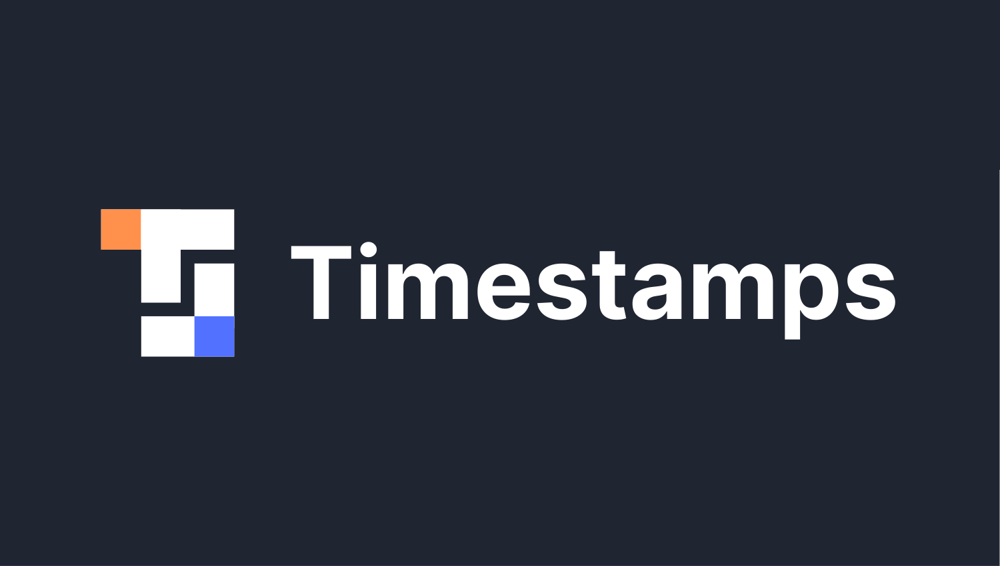
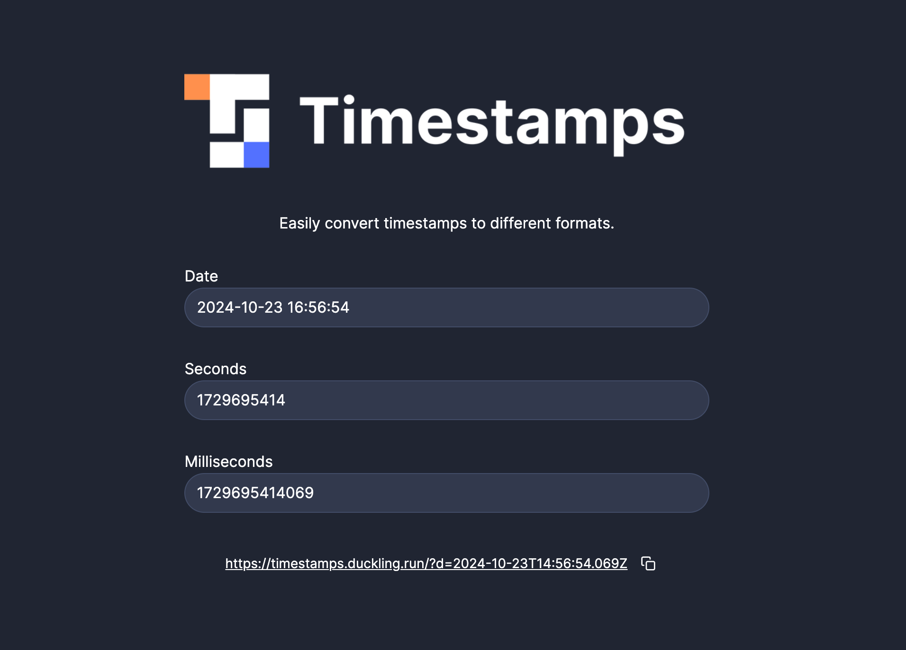

Easily convert timestamps to different formats.

---

I often finding myself needing to convert timestamps between different formats. Usually, I'd just Google a tool to do it and use the first one available.

I recently discovered SvelteKit and thought it would be cool to take a stab at it by building a simple converter.

## Technology

- **[SvelteKit](https://svelte.dev/)** for the actual application
- **[Skeleton UI](https://www.skeleton.dev/)** for the UI elements
- **[Date Picker Svelte](https://www.npmjs.com/package/date-picker-svelte)** for the date picker, since Skeleton doesn't have one.

## Getting Started

1. Clone the repository
2. Open a terminal window and navigate to the root directory
3. Run the application using `npm run dev`
4. Navigate to the URL displayed in the terminal window.

## Contributing

If you find an error, please feel free to open an issue in GitHub and I'll take a look.

You're also more than welcome to contribute code if you'd like by forking the repository, making the change and making a pull request.
